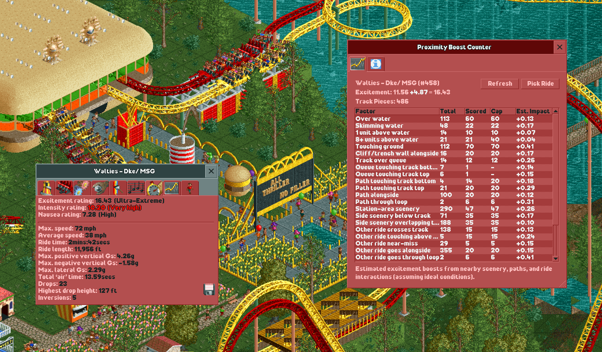

# Proximity Boost Counter

**Proximity Boost Counter** is an OpenRCT2 plugin that helps you understand how much nearby scenery, paths, water, and other rides contribute to your coaster’s proximity-related excitement bonuses.

This tool is focused on **roller coasters only**.

## Features

- Plugin menu entry: **Proximity Boost Counter**
- Keyboard shortcut: **Ctrl+P** (or **GUI+P**)
- Shows a breakdown table of nearby scenery, tracks and paths that factor into your excitement rating
- Shows total counts, cap, and the number of items that were included in the score
- Estimated score impact per factor, so you can see what's actually moving the needle
- Detailed explanation text for the selected row
- Refresh button to recalculate after edits
- Pick button to choose another ride

## Column guide

| Column | Description |
|---|---|
| **Total** | Number of qualifying track pieces found, uncapped. |
| **Scored** | The capped count used in the actual calculation. Some factors add a seed bonus the moment you have any qualifying piece at all. |
| **Cap** | The maximum number of pieces that contribute to this factor's score. |
| **Est. Impact** | Approximate excitement gain under ideal conditions. Assumes no intensity penalty and uses known vehicle multipliers. Custom train types may not report accurate values. |

## How it works

When you select a coaster, the plugin scans the map for that ride’s track elements and scores nearby interactions (for example: over water, near paths, near scenery, and near other track). It then displays per-factor counts in the window so you can see where your proximity score is coming from.

## Usage

1. Open OpenRCT2.
2. Launch the plugin using either:
   - Menu: **Proximity Boost Counter**
   - Shortcut: **Ctrl+P**
3. The plugin window opens. Click **Pick** and then click a coaster (or one of its vehicles) with the crosshair.
4. Inspect the table and click rows to view explanations and estimated score impacts.
5. Use **Refresh** after track/scenery changes.

## Build (development)

From this folder:

1. Install dependencies:
   - `npm install`
2. Build and copy to your OpenRCT2 plugin folder:
   - `npm run build`

The build script writes a timestamped build into `builds/` and also copies the latest output to your live OpenRCT2 plugin path.

## License

GNU General Public License v3.0.

See [gpl-3.0.txt](gpl-3.0.txt) for the full license text.

## Author & Support

By RYJASM. If you like this plugin give it a star on Github. Let me know if you find any bugs.
